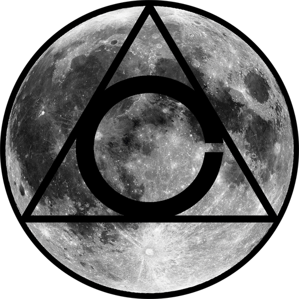

<!-- HEADING -->

<p align="center">
  
</p>
<h1 align="center">️relax</h1>

<!-- DESCRIPTION -->

<h3 align="center">
  <span role="img" aria-label="Wind Face">🌬️</span>
</h3>
<p align="center">
  <strong>Just relax.</strong><br>
  Created with <a href="https://unity3d.com/" target="_blank">Unity</a> to showcase calm vaporwave viewing and <a href="https://en.wikipedia.org/wiki/Procedural_generation" target="_blank">procedural generation</a>.
</p>

<!-- BADGES -->

<p align="center">
    <a href="https://github.com/acfromspace/relax/blob/master/LICENSE">
        </a>
    <a href="https://www.repostatus.org/#unsupported">
        </a>
</p>

<!-- FEATURES -->


[*relax*](https://acfromspace.itch.io/relax) is a video game with the following features:

- **Premise.** As a soul filled with no colour, you wander the universe to fill yourself with colour hoping to find a sense of happiness.

- **Design Idea.** Usually video games have objectives to complete, but I just wanted to create a video game where you can just turn it on and be a world viewer.

- **Future endeavors.** How I envisioned the game was to start off with a character of grey hues. Eventually the character would set off around the world, solve puzzles, and open up the colours hidden away to share with everyone. I would love to include backtracking where the worlds are in greyscale, but as you unlock colours, the player realizes there is more to previous areas as the colours show other puzzles.

<!-- QUICK INSTALLATION -->

## <span role="img" aria-label="Sparkles">✨</span> Quick Installation

Go to <a href="https://acfromspace.itch.io/relax" target="_blank">https://acfromspace.itch.io/relax</a> and download the `.exe` file!

<!-- IN-DEPTH GUIDE -->

## <span role="img" aria-label="Video Game">🎮</span> Controls

```txt
Use mouse to navigate the menu.
Further instructions in-game.
```

<!-- WHAT'S INSIDE? -->

## <span role="img" aria-label="Thinking Face">🤔</span> What's inside?

A quick look at the top-level files and directories you'll see in this project.

```
  .
1 ├── Development Area/
2 ├── Game Documentation/
3 ├── Game Executable/
4 ├── Game Screenshots/
5 ├── .gitignore
6 ├── avatar.png
7 ├── LICENSE   
8 └── README.md
```

1.  **`Development Area/`**: Unity project files.
2.  **`Game Documentation/`**: Game Design Document (GDD) and Technical Design Document (TDD).
3.  **`Game Executable/`**: The droids you're looking for are here.
4.  **`Game Screenshots/`**: Screenshots that showcase the video game.
5.  **`.gitignore`**: This file tells `.git` which files it should not track nor maintain a version history for. For instance, you shouldn't let anyone get your `.env` files. (These usually contain your API keys)
6.  **`avatar.png`**: Image used in the README.md.
7.  **`LICENSE`**: An open source license that protects contributors and users depending on the license chosen.
8.  **`README.md`**: A markdown file containing useful reference information about your project. The file you're reading right now!

<!-- LICENSE -->

## <span role="img" aria-label="Oncoming Police Car">🚔</span> [License](LICENSE)

The code in this project is under a specific open source license.
